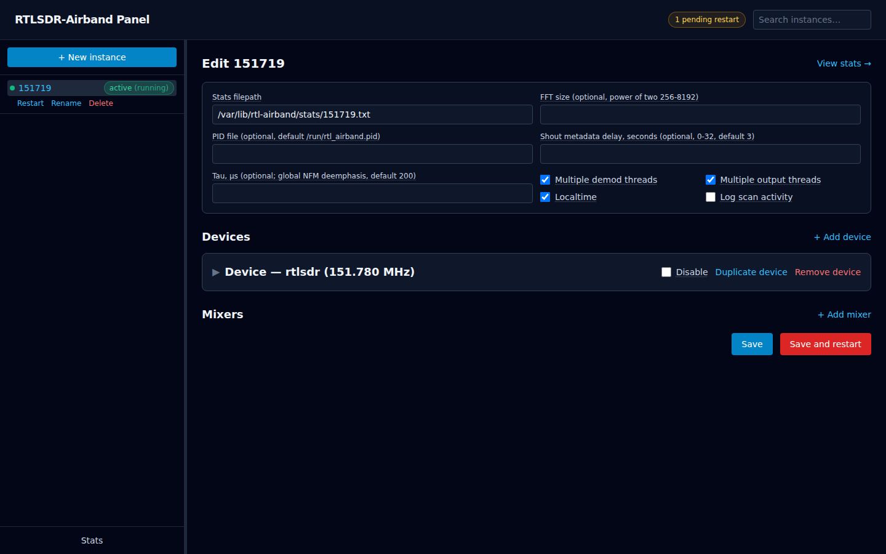
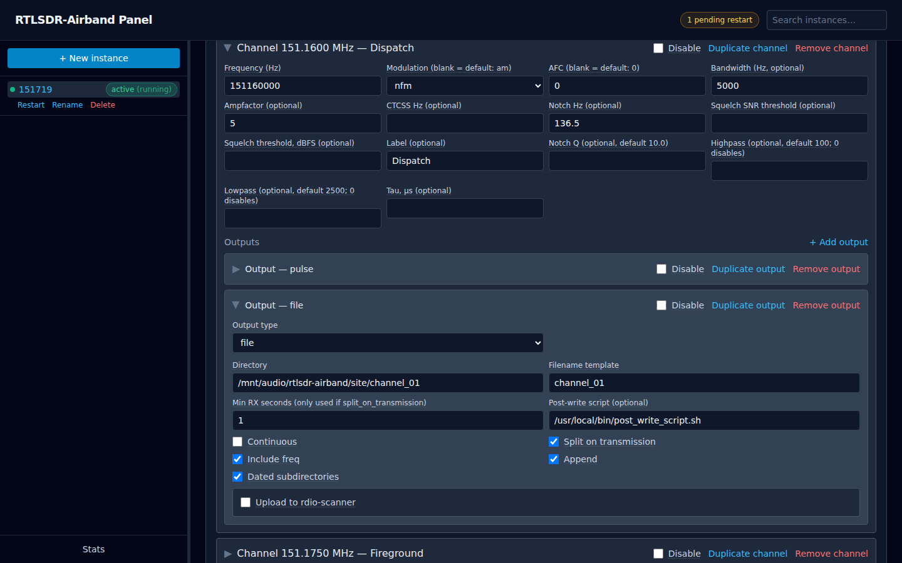
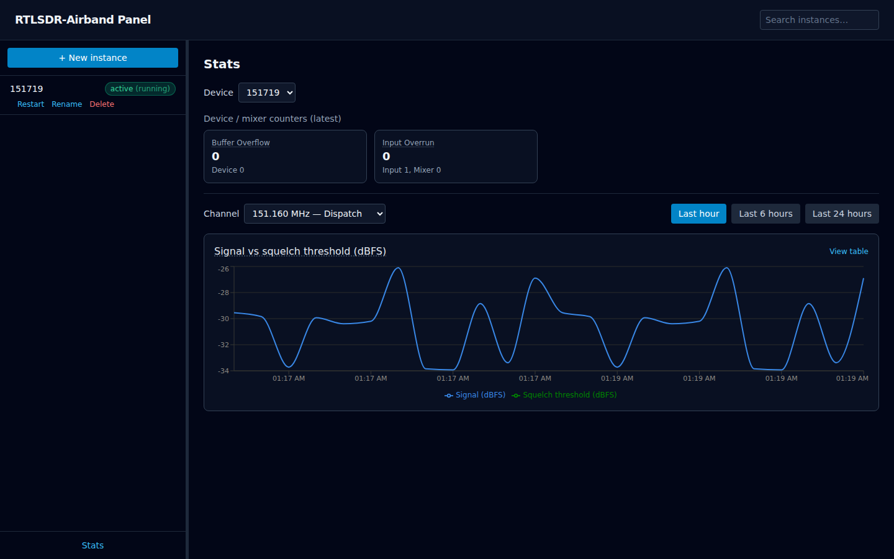

# rtl-airband-panel

[](https://github.com/jschmall/rtl-airband-panel/actions/workflows/ci.yml)
[](./LICENSE)

A web control panel for [RTLSDR-Airband](https://github.com/rtl-airband/RTLSDR-Airband) instances.

Each SDR runs as its own systemd-managed `rtl_airband` process with its own
`.conf` file — one service per instance. Editing those files by hand and
remembering which unit to restart doesn't scale much past a couple of
instances. This panel gives you one place to view, edit, and restart all of
them, with validation before anything is written to disk.

## Project goals

- **Safe by default.** A config write that fails validation never touches
  disk or systemd — nothing runs until it's confirmed valid.
- **Minimal blast radius.** Editing one instance restarts only that
  instance's systemd unit, never anything else running on the box.
- **No pretending upstream can hot-reload.** RTLSDR-Airband reads its
  config once at startup and has no live-reload path, so the panel is
  upfront about needing a restart after a change, and tracks which
  instances are waiting for one instead of hiding it.
- **Configs stay readable.** Changes go through a JSON model and back out
  to a normal `.conf` file — not a black box. You can always open the file
  yourself and see exactly what changed.

## Features

**Config editing**
- Editor for devices, channels, mixers, and all six RTLSDR-Airband output
  types (`pulse`, `file`, `rawfile`, `icecast`, `udp_stream`, `mixer`),
  including rdio-scanner call uploads
- Drag-and-drop channel reordering
- Duplicate/clone buttons, and a "copy to channel" action for outputs
- Search across all instances by frequency, modulation, or device

**Safety and validation**
- Inline validation with human-readable messages before you save
- Checks for frequency-window and FFT bin collisions, CTCSS tone validity,
  and per-output-type constraints
- Secrets (stream passwords, etc.) redacted by default in the UI and API
- Automatic config backups kept on every save

**Operations**
- Pending-restart tracking, with one-click bulk restart for everything
  waiting
- Config import and export
- Live, streaming log viewer per instance
- Per-instance health checks

**Monitoring**
- Historical charts: signal vs. squelch threshold per channel, buffer and
  overrun counters, mixer stats
- A `/metrics` endpoint in Prometheus format

## Screenshots

Instance list and config editor, with the cross-instance search and
pending-restart indicator in the header:



A channel expanded showing its outputs, with the channel's label next to
its frequency in the header:



Per-channel signal history:



(Instance name, frequencies, and labels above are placeholder data from the
repo's sanitized [test fixture](./fixtures/151719.conf), not a real
deployment.)

## Installing

**Prerequisites:** Node.js 20 or newer, and npm. Check what you have:

```bash
node --version
npm --version
```

This is a hard requirement — the app will fail to start on Node 18.

To control real systemd units (start/stop/restart actual `rtl_airband`
services), the user running the panel needs `sudo` access to `systemctl`.
This is optional — see [Systemd control](#systemd-control) below. Without
it, the panel still runs fully in a safe simulated mode.

Clone the repository and install:

```bash
git clone https://github.com/jschmall/rtl-airband-panel.git
cd rtl-airband-panel
npm install
npm run build:deps
```

`npm run build:deps` builds the internal packages the rest of the app
depends on. It's required before the first run, and after every
`git pull` — skipping it is the most common cause of "I fixed it but it's
still broken."

## First run

Build and start the server:

```bash
npm run build
npm start --workspace=backend/api
```

Open `http://localhost:3000` in a browser.

By default:

- The server only listens on `127.0.0.1`, reachable from this machine only.
- Systemd actions are simulated, not real — the panel logs what it would do
  instead of calling `systemctl`. Nothing on the real system is touched.
- It looks for instance `.conf` files in
  `/etc/rtl-airband-panel/instances`.

All of this is configurable — see [Configuration](#configuration) below.

To run this for real — reachable on your network, as a systemd service,
behind a reverse proxy, or with real systemd control enabled — see
[DEPLOYMENT.md](./DEPLOYMENT.md).

## Configuration

The server can be configured three ways, and they can be mixed:

- Command-line flags, e.g. `npm start --workspace=backend/api -- --port 8080`
- Environment variables, e.g. `RTL_PANEL_PORT=8080 npm start --workspace=backend/api`
- A `.env` file in the directory you invoke `npm`/`node` from (or a custom
  path via `--env-file <path>`)

If the same setting is given more than one way, the order of precedence,
highest first, is: command-line flag, then environment variable, then
`.env` file, then the default below. A missing `.env` file is not an
error — it's simply skipped.

See [`.env.example`](.env.example) in the repo root for a template covering
every setting — copy it to `.env` in the directory you run
`npm start --workspace=backend/api` from, and adjust as needed (only the
settings you want to override need to be present).

Run `node backend/api/dist/index.js --help` after building to see the full
flag list.

| Environment variable | Flag | Default | Purpose |
|---|---|---|---|
| `RTL_PANEL_INSTANCES_DIR` | `--instances-dir` | `/etc/rtl-airband-panel/instances` | Directory containing per-instance `.conf` files. Also holds a `.pending-restarts.json` written by the panel itself, tracking which instances have a saved config their running unit hasn't picked up yet — safe to ignore, don't edit it by hand |
| `RTL_PANEL_UNIT_DIR` | `--unit-dir` | `/etc/systemd/system` | Where systemd unit files are installed |
| `RTL_PANEL_RTL_AIRBAND_BIN` | `--rtl-airband-bin` | `/usr/local/bin/rtl_airband` | Binary path used in generated unit files |
| `RTL_PANEL_SYSTEMD_MODE` | `--systemd-mode` | `mock` | `mock` (safe, no real systemctl calls) or `sudo` (real) |
| `RTL_PANEL_SUDO_UNIT_PREFIX` | `--sudo-unit-prefix` | `` (empty) | In `sudo` mode, only act on units named `<prefix>*.service`; empty means no restriction beyond the existing safe-name check. See [Systemd control](#systemd-control) |
| `RTL_PANEL_PORT` | `--port` | `3000` | API listen port |
| `RTL_PANEL_HOST` | `--host` | `127.0.0.1` | API listen host |
| `RTL_PANEL_LOG_LEVEL` | `--log-level` | `info` | Pino log level for the panel's own process: `fatal`, `error`, `warn`, `info`, `debug`, `trace`, or `silent` |
| `RTL_PANEL_FRONTEND_DIST` | `--frontend-dist` | `frontend/dist` (repo-relative) | Where to look for the frontend's build to serve as a single process; a missing build is not an error, it just falls back to API-only |
| `RTL_PANEL_STATS_DB_PATH` | `--stats-db-path` | `~/.rtl-airband-panel/stats.db` | SQLite file the stats poller writes historical samples to |
| `RTL_PANEL_STATS_POLL_INTERVAL_MS` | `--stats-poll-interval-ms` | `15000` | How often each instance's stats file is re-read |
| `RTL_PANEL_STATS_RETENTION_DAYS` | `--stats-retention-days` | `7` | Samples older than this are pruned each poll cycle; `0` or negative disables pruning |

### Systemd control

Instance names map to config files and systemd units by a fixed convention:
`<name>.conf` ↔ `<name>.service`, matching basenames exactly, no `@`
templating. The name itself is entirely up to you — `rtl_151780`,
`office-scanner`, `151780`, whatever fits your own systemd units. Setting
`RTL_PANEL_SYSTEMD_MODE=sudo` (or `--systemd-mode sudo`) makes the backend
shell out to real `sudo systemctl` commands. Only turn this on once you're
ready to affect real running instances, and consider testing against a
non-critical instance first.

**Scoping sudo access to your instances.** By default
(`RTL_PANEL_SUDO_UNIT_PREFIX` unset), `sudo` mode will act on any unit
whose name passes the existing safe-name check — there's no naming
convention forced on you. That also means, on its own, sudo access isn't
scoped by *which* units they are, only by which `systemctl`/`tee`/`rm`
commands the adapter is allowed to run at all (see the sudoers rule in
[DEPLOYMENT.md](./DEPLOYMENT.md#running-the-panel-as-a-systemd-service)).
If you'd rather the panel's sudo grant be provably limited to only the
units it manages, set `RTL_PANEL_SUDO_UNIT_PREFIX` to a prefix your
instance names always start with (e.g. `rtl_` if you name instances
`rtl_151780`, `rtl_office`, etc.) — the adapter will then refuse
in-process to act on any unit not starting with it, and you write a
matching glob into the sudoers rule (see
[`deploy/rtl-airband-panel.sudoers`](./deploy/rtl-airband-panel.sudoers),
which uses `rtl_` as its example). The two checks — the adapter's
in-process prefix check and the sudoers glob — need to agree for an action
to reach systemd; a mismatch fails closed (the adapter rejects, or sudo
denies), never open. If your instances don't share a common prefix, leave
it unset and rely on the command-scoping alone.

### Stats & graphing

RTLSDR-Airband writes each instance's `stats_filepath` in real Prometheus
text-exposition format (`# HELP`/`# TYPE` comments, `metric{labels}`
lines) — per-channel signal/noise/squelch levels and counters, plus
device/mixer overrun counters — but it rewrites the file in full on every
write (roughly every 15 seconds), so it holds only the latest snapshot, no
history.

`backend/api` polls each running instance's stats file on that same
cadence and records every sample into a local SQLite database
(`RTL_PANEL_STATS_DB_PATH`), skipping a read if the file's modification
time hasn't changed (a stopped instance doesn't get repeated identical
rows). The Stats page charts signal-vs-squelch-threshold per channel over a
selectable time window, plus per-channel and per-device counters as tiles.
Retention is capped by `RTL_PANEL_STATS_RETENTION_DAYS` (default 7 days;
pruned on every poll cycle).

## Current scope

The JSON model covers both `multichannel`- and `scan`-mode devices,
top-level mixer *definitions* (the `mixers: { ... }` group itself, not just
a channel routing into one by name), all six RTLSDR-Airband output types
(`pulse`, `file`, `rawfile`, `icecast`, `udp_stream`, `mixer`) including the
rdio-scanner call-upload block, and per-channel options like
`highpass`/`lowpass`/`tau`/`label`/`labels`.

## Learn more

- [DEPLOYMENT.md](./DEPLOYMENT.md) — running this as a real service:
  network exposure, reverse proxies, systemd, logs and backups.
- [CONTRIBUTING.md](./CONTRIBUTING.md) — how the pieces fit together, the
  test suite, and the conventions a change is expected to follow.
- [CLAUDE.md](./CLAUDE.md) — the fuller set of architectural constraints.

## License

[GPL-2.0](./LICENSE).
