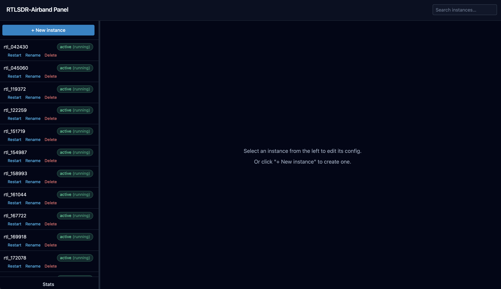
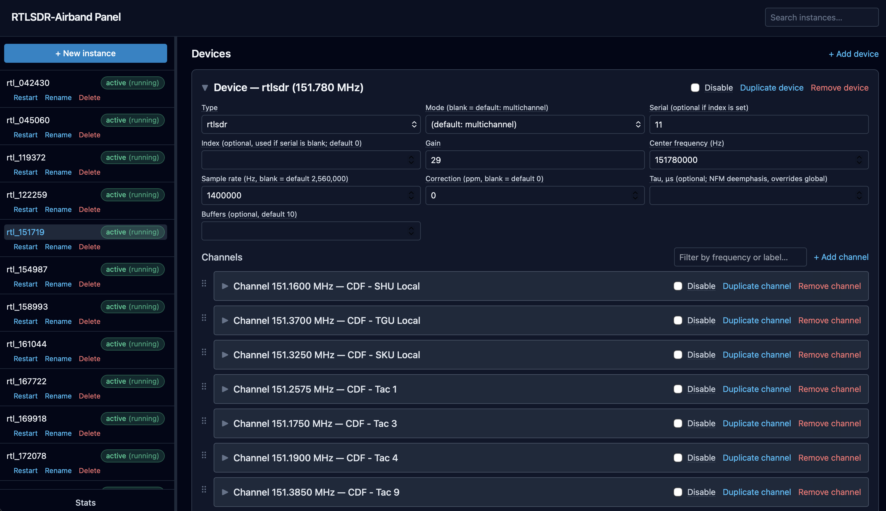
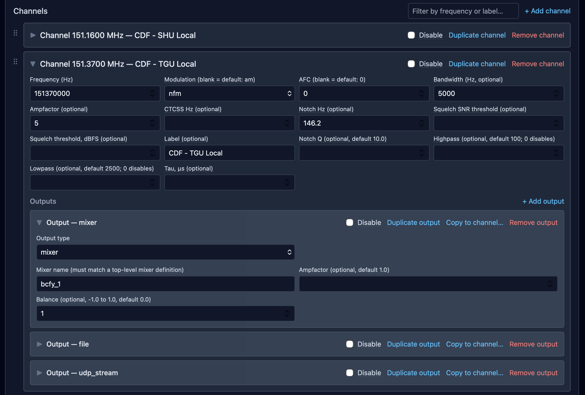

# rtl-airband-panel

[](https://github.com/jschmall/rtl-airband-panel/actions/workflows/ci.yml)
[](./LICENSE)

A web control panel for [RTLSDR-Airband](https://github.com/rtl-airband/RTLSDR-Airband) instances.

Each SDR runs as its own systemd-managed `rtl_airband` process with its own
`.conf` file — one service per instance. Editing those files by hand and
remembering which unit to restart doesn't scale much past a couple of
instances. This panel gives you one place to view, edit, and restart all of
them, with validation before anything is written to disk.

## Project goals

- **Safe by default.** A config write that fails validation never touches
  disk or systemd — nothing runs until it's confirmed valid.
- **Minimal blast radius.** Editing one instance restarts only that
  instance's systemd unit, never anything else running on the box.
- **No pretending upstream can hot-reload.** RTLSDR-Airband reads its
  config once at startup and has no live-reload path, so the panel is
  upfront about needing a restart after a change, and tracks which
  instances are waiting for one instead of hiding it.
- **Configs stay readable.** Changes go through a JSON model and back out
  to a normal `.conf` file — not a black box. You can always open the file
  yourself and see exactly what changed.

## Features

**Config editing**
- Editor for devices, channels, mixers, and all seven RTLSDR-Airband output
  types (`pulse`, `file`, `rawfile`, `icecast`, `udp_stream`, `mixer`,
  `mixer_remote`), including rdio-scanner call uploads — that output type
  and `mixer_remote` (plus a mixer's `remote_inputs` block) both require
  [this fork](https://github.com/jschmall/RTLSDR-Airband) of RTLSDR-Airband,
  not the upstream project
- Drag-and-drop channel reordering (mouse, touch, and keyboard)
- Duplicate/clone buttons, and a "copy to channel" action for outputs
- Search across all instances by frequency, modulation, or device
- Usable on a phone or tablet, not just desktop — the sidebar becomes a
  slide-out drawer and dense field grids stack to fewer columns below a
  tablet-ish width

**Safety and validation**
- Inline validation with human-readable messages before you save
- Checks for frequency-window and FFT bin collisions, CTCSS tone validity,
  per-output-type constraints, and RTL-SDR's actual supported sample-rate
  ranges
- Secrets (stream passwords, etc.) redacted by default in the UI and API
- Automatic config backups kept on every save

**Operations**
- Create, rename, and delete instances — renaming or deleting restarts or
  stops the underlying systemd unit, and the panel warns you before it does
- Pending-restart tracking, with one-click bulk restart for everything
  waiting
- Config import and export
- Live, streaming log viewer per instance, with an optional structured
  JSON log format (requires the same RTLSDR-Airband fork noted above)
- Per-instance health checks

**Monitoring**
- Historical charts: signal vs. squelch threshold per channel, buffer and
  overrun counters, mixer stats
- A `/metrics` endpoint in Prometheus format

## Live apply without a restart

Requires an RTLSDR-Airband build from
[`jschmall/RTLSDR-Airband`](https://github.com/jschmall/RTLSDR-Airband)
(merged to that fork's `main` — [PR #18](https://github.com/jschmall/RTLSDR-Airband/pull/18)),
which gives a running instance a Unix domain control socket for live
retune/reconfiguration — so some config changes can take effect without the
full restart cycle every other change still requires. Not available against
upstream RTLSDR-Airband, or against a fork build older than that merge —
older/non-fork `rtl_airband` builds simply don't understand the protocol at
all, and the panel falls back to a normal restart-based save whenever the
socket is unreachable.

### New config fields

- **`control_socket_path`** (new top-level config field) — set this to the
  same Unix domain socket path the RTLSDR-Airband process is configured to
  listen on, and the panel gains a new **Apply live** button (next to Save
  and Save-and-restart). The path itself is arbitrary — any filesystem
  location works, there's no required directory or name — but it must be
  **unique per instance** (it's a real `bind()`; two instances sharing a
  path silently lose the race, see "Failure behavior" below) and writable
  by whichever user the instance's systemd unit runs as. Something like
  `/run/rtl-airband/<instance-name>.sock` per instance keeps this
  self-documenting. The panel does not check uniqueness across instances
  for you — only that the field isn't empty.
- **`bandwidth`** on a device (rtlsdr only) — the tuner's hardware capture
  bandwidth in Hz, `0`/blank for automatic. Distinct from a channel's own
  `bandwidth`, which is a post-demodulation audio filter, not a capture
  setting.
- **`correction`** on a device — frequency correction (PPM for
  rtlsdr/mirisdr, ppm-as-float for soapysdr). Already supported for a
  normal restart-based save even without the fork; the control socket is
  what makes changing it take effect live.
- **`enabled` field** on channels and mixers — distinct from the existing
  `disable`: `disable` permanently skips allocating that channel/mixer at
  parse time, while `enabled = false` still allocates it but starts it
  live-off, so it can be flipped on later via the control socket with no
  restart.
- **`reserve_channels` field** on devices (multichannel only) — reserves
  extra channel-array headroom at startup so a device's `channels` list can
  be edited later and picked up live via the same `reload_diff` command, no
  restart, as long as growth stays within the reserved headroom. This
  covers more than a tail append: adding, removing, and editing an existing
  channel's fields (freq/modulation/bandwidth/squelch/notch/ctcss/outputs)
  all apply live now, anywhere in the list — a non-tail change tears down
  and rebuilds every channel after the point of divergence (a brief
  interruption, not data loss) as a side effect. `reserve_inputs` (below)
  covers the equivalent headroom for a mixer's inputs. Adding a mixer or
  device that wasn't in the original config still requires a restart.
- **`reserve_inputs` field** on mixers — the mixer-side counterpart to
  `reserve_channels`: reserves extra mixer-input headroom so a
  dynamically-added or -edited channel whose output routes into this mixer
  (`type: "mixer"`) can connect live, within that headroom, no restart.
- **`mixer_remote` output type / mixers' `remote_inputs` field** — a
  separate, non-upstream RTLSDR-Airband fork feature (needs a build from
  its `mixer_remote_input` branch specifically, not the `dynamic_reload`
  one this section is otherwise about). The two halves behave differently
  under Apply live: a `mixer_remote` output is an ordinary output like any
  other, so editing or removing one on an existing channel applies live
  within that device's `reserve_channels` headroom same as always — but a
  mixer's `remote_inputs` entries are always restart-only, since
  RTLSDR-Airband only ever connects those slots once, at startup. See
  [Cross-instance mixer input](#cross-instance-mixer-input-mixer_remote)
  below for what it does and how to configure it.

### What Apply live can push without a restart

Clicking **Apply live** saves the config, then asks the running process to
live-apply whatever it safely can via `reload_diff` (which re-reads the
`.conf` file this just wrote), reporting back exactly what applied and
what's still pending. Currently live-appliable, all via that one
`reload_diff` call:

- **Centerfreq** (device retune)
- **Sample rate** — expensive (a full RX-thread stop/reopen/restart under
  the hood), but no longer restart-only
- **Gain**
- **Bandwidth** (rtlsdr tuner bandwidth, above)
- **Correction** (PPM, above)
- Channel/mixer **enable/disable** (the `enabled` field, above)
- Channel **add/edit/remove**, within a device's `reserve_channels`
  headroom (above)

Everything else — device/mixer count, driver `type`, `mode`, and any field
not listed above — still requires a restart.

**Failure behavior.** A field that's present in the config but fails to
apply at the hardware level (a transient i2c error, an unreachable device,
a socket-path collision leaving that instance's control socket never
started, etc.) is reported back distinctly from a field that's simply not
live-appliable at all: the Apply live result splits into "still needs a
restart" and "didn't take — no restart needed, just click Apply live
again" sections, so a flaky retry doesn't get conflated with something
that genuinely requires stopping the unit. None of these failures crash or
restart the instance on their own — RTLSDR-Airband keeps running at its
previous settings and simply reports the attempt as unsuccessful.

### Operational details

- Talks to the socket directly (`backend/api/src/control-socket/`). The
  control socket's `SO_PEERCRED` check requires an *exact* UID match
  against the daemon's own process, so the systemd unit needs an explicit
  `User=`/`Group=` matching whatever account the panel connects as — set
  via the opt-in "Service account" fields on each instance's edit page
  (`serviceUser`/`serviceGroup`, panel-only settings, not part of the
  `.conf` file). Left unset, the unit runs as root and Apply live fails
  with a permission error; the edit page warns inline when this applies.
- A 1-second per-instance cooldown throttles back-to-back Apply live
  clicks against the same instance (the config is still saved to disk
  either way; only the live-apply attempt itself is skipped and reported
  as "applied too recently").
- The fork tracks a `centerfreq_retune_failure_count` metric per device
  (surfaced on the stats page and `/metrics`) — how many live retune
  attempts (from Apply live, or the fork's own scan-mode frequency
  hopping) failed at the hardware level. A climbing count on otherwise
  healthy hardware points at a flaky tuner or i2c bus, not a crash risk.

### What's not here yet

The control socket also exposes `retune`, `set_gain`, `set_bandwidth`,
`set_correction`, `set_sample_rate`, `channel_enable`/`channel_disable`,
and `mixer_enable`/`mixer_disable` as individual live-control commands —
the panel only wires up the coarser `reload_diff` command, not per-field
live controls. Mixer/device add still always requires a restart. See
[issue #4](https://github.com/jschmall/rtl-airband-panel/issues/4) for a
known follow-up (page-level test coverage for the Apply live button).

## Cross-instance mixer input (`mixer_remote`)

Requires an RTLSDR-Airband build from
[`jschmall/RTLSDR-Airband`](https://github.com/jschmall/RTLSDR-Airband)'s
`mixer_remote_input` branch — a separate fork feature from the live-apply
one above (different branch, not yet merged to that fork's `main`); the two
aren't related and don't require each other.

Lets a mixer in one instance absorb a live audio input streamed from a
channel in a *different* instance's process, over a Unix domain socket —
useful on a host that runs several instances and wants to combine channels
from separate SDRs into one mixed stream, without a network hop. The
transport is same-host and same-OS-user only: the receiving instance's
socket only accepts packets from a sender running as its own user (checked
via `SCM_CREDENTIALS`, the same trust model `dynamic_reload`'s control
socket uses via `SO_PEERCRED`), so there's no separate authentication step
to configure and no exposure beyond the local machine.

**Sending side** — any channel (a device channel, or a mixer's own
embedded channel) gets a `mixer_remote` output, chosen from the same
output-type dropdown as every other output type:

```
outputs: (
  { type = "mixer_remote"; dest_path = "/run/rtl-airband/other-instance.sock"; stream_id = 0; }
);
```

**Receiving side** — the mixer that should absorb the input gets an entry
in its "Remote inputs" section, editable alongside its regular outputs;
each entry reserves one mixer-input slot:

```
mixers: {
  mymix: {
    remote_inputs: (
      { listen_path = "/run/rtl-airband/mymix.sock"; stream_id = 0; ampfactor = 1.0; balance = 0.0; label = "site2 ch1"; }
    );
    outputs: ( /* ... */ );
  };
};
```

`dest_path` on the sender must match `listen_path` on the receiver
exactly, and `stream_id` must match too — that's how the receiver tells
multiple senders apart when several share one `listen_path`. The panel
validates both: a negative `stream_id`, an out-of-range `balance`, or two
`remote_inputs` entries reusing the same `(listen_path, stream_id)` pair
anywhere in the instance's config (not just within one mixer — the fork
shares one listener registry per `listen_path` across every mixer) are all
flagged before you can save. Keep `dest_path`/`listen_path` short — these
are real Unix domain socket paths, capped at 107 bytes by the OS.

**Live apply.** The two sides behave differently. A `mixer_remote`
output is an ordinary channel output like any other, so editing or
removing one on an *existing* channel applies live via Apply live, within
that device's `reserve_channels` headroom, same as any other output-field
change — no special restriction. A mixer's `remote_inputs` entries are
different: RTLSDR-Airband only ever connects those slots once, at
startup (`parse_mixers()`), so there's no live-apply path for them at
all — adding, removing, or editing an entry always requires a restart.
Editing `remote_inputs` and clicking Apply live still saves the config
and reports the mixer correctly under "still needs a restart" (the fork's
`reload_diff` was fixed to detect and report this explicitly, rather than
silently doing nothing) — it just won't take effect until that restart
happens.

## Screenshots

The instance list, with the cross-instance search bar in the header and
each instance's live systemd status next to it:



An instance's config editor: its one device, and the channels defined on
it:



A channel expanded, showing its demodulation settings and its outputs
(here, a mixer, a file, and a UDP stream):



The stats page: device counters, a signal-vs-squelch-threshold chart for a
selected channel, mixer stats, and channel counters:


## Installing

**Prerequisites:** Node.js 20 or newer, and npm. Check what you have:

```bash
node --version
npm --version
```

This is a hard requirement — the app will fail to start on Node 18.

To control real systemd units (start/stop/restart actual `rtl_airband`
services), the user running the panel needs `sudo` access to `systemctl`.
This is optional — see [Systemd control](#systemd-control) below. Without
it, the panel still runs fully in a safe simulated mode.

Clone the repository and install:

```bash
git clone https://github.com/jschmall/rtl-airband-panel.git
cd rtl-airband-panel
npm install
npm run build:deps
```

`npm run build:deps` builds the internal packages the rest of the app
depends on. It's required before the first run, and after every
`git pull` — skipping it is the most common cause of "I fixed it but it's
still broken."

## First run

Build and start the server:

```bash
npm run build
npm start --workspace=backend/api
```

Open `http://localhost:3000` in a browser.

By default:

- The server only listens on `127.0.0.1`, reachable from this machine only.
- Systemd actions are simulated, not real — the panel logs what it would do
  instead of calling `systemctl`. Nothing on the real system is touched.
- It looks for instance `.conf` files in
  `/etc/rtl-airband-panel/instances`.

All of this is configurable — see [Configuration](#configuration) below.

To run this for real — reachable on your network, as a systemd service,
behind a reverse proxy, or with real systemd control enabled — see
[DEPLOYMENT.md](./DEPLOYMENT.md).

## Configuration

The server can be configured three ways, and they can be mixed:

- Command-line flags, e.g. `npm start --workspace=backend/api -- --port 8080`
- Environment variables, e.g. `RTL_PANEL_PORT=8080 npm start --workspace=backend/api`
- A `.env` file in the directory you invoke `npm`/`node` from (or a custom
  path via `--env-file <path>`)

If the same setting is given more than one way, the order of precedence,
highest first, is: command-line flag, then environment variable, then
`.env` file, then the default below. A missing `.env` file is not an
error — it's simply skipped.

See [`.env.example`](.env.example) in the repo root for a template covering
every setting — copy it to `.env` in the directory you run
`npm start --workspace=backend/api` from, and adjust as needed (only the
settings you want to override need to be present).

Run `node backend/api/dist/index.js --help` after building to see the full
flag list.

| Environment variable | Flag | Default | Purpose |
|---|---|---|---|
| `RTL_PANEL_INSTANCES_DIR` | `--instances-dir` | `/etc/rtl-airband-panel/instances` | Directory containing per-instance `.conf` files. Also holds a `.pending-restarts.json` written by the panel itself, tracking which instances have a saved config their running unit hasn't picked up yet — safe to ignore, don't edit it by hand |
| `RTL_PANEL_UNIT_DIR` | `--unit-dir` | `/etc/systemd/system` | Where systemd unit files are installed |
| `RTL_PANEL_RTL_AIRBAND_BIN` | `--rtl-airband-bin` | `/usr/local/bin/rtl_airband` | Binary path used in generated unit files |
| `RTL_PANEL_SYSTEMD_MODE` | `--systemd-mode` | `mock` | `mock` (safe, no real systemctl calls) or `sudo` (real) |
| `RTL_PANEL_SUDO_UNIT_PREFIX` | `--sudo-unit-prefix` | `` (empty) | In `sudo` mode, only act on units named `<prefix>*.service`; empty means no restriction beyond the existing safe-name check. See [Systemd control](#systemd-control) |
| `RTL_PANEL_PORT` | `--port` | `3000` | API listen port |
| `RTL_PANEL_HOST` | `--host` | `127.0.0.1` | API listen host |
| `RTL_PANEL_LOG_LEVEL` | `--log-level` | `info` | Pino log level for the panel's own process: `fatal`, `error`, `warn`, `info`, `debug`, `trace`, or `silent` |
| `RTL_PANEL_LOG_FILE` | `--log-file` | unset (stdout) | Write the panel's own logs (NDJSON) to this file instead of stdout. Only affects the panel's own request/audit logging — it does not touch `sudo`'s own PAM/session-accounting lines in syslog, which the OS writes regardless of this setting; see [Systemd control](#systemd-control) for why those exist and how `sudo`-mode health polling minimizes them |
| `RTL_PANEL_FRONTEND_DIST` | `--frontend-dist` | `frontend/dist` (repo-relative) | Where to look for the frontend's build to serve as a single process; a missing build is not an error, it just falls back to API-only |
| `RTL_PANEL_STATS_DB_PATH` | `--stats-db-path` | `~/.rtl-airband-panel/stats.db` | SQLite file the stats poller writes historical samples to |
| `RTL_PANEL_STATS_POLL_INTERVAL_MS` | `--stats-poll-interval-ms` | `15000` | How often each instance's stats file is re-read |
| `RTL_PANEL_STATS_RETENTION_DAYS` | `--stats-retention-days` | `7` | Samples older than this are pruned each poll cycle; `0` or negative disables pruning |

### Systemd control

Instance names map to config files and systemd units by a fixed convention:
`<name>.conf` ↔ `<name>.service`, matching basenames exactly, no `@`
templating. The name itself is entirely up to you — `rtl_151780`,
`office-scanner`, `151780`, whatever fits your own systemd units. Setting
`RTL_PANEL_SYSTEMD_MODE=sudo` (or `--systemd-mode sudo`) makes the backend
shell out to real `sudo systemctl` commands. Only turn this on once you're
ready to affect real running instances, and consider testing against a
non-critical instance first.

**Scoping sudo access to your instances.** By default
(`RTL_PANEL_SUDO_UNIT_PREFIX` unset), `sudo` mode will act on any unit
whose name passes the existing safe-name check — there's no naming
convention forced on you. That also means, on its own, sudo access isn't
scoped by *which* units they are, only by which `systemctl`/`journalctl`/
`tee`/`rm` commands the adapter is allowed to run at all (see the sudoers rule in
[DEPLOYMENT.md](./DEPLOYMENT.md#running-the-panel-as-a-systemd-service)).
If you'd rather the panel's sudo grant be provably limited to only the
units it manages, set `RTL_PANEL_SUDO_UNIT_PREFIX` to a prefix your
instance names always start with (e.g. `rtl_` if you name instances
`rtl_151780`, `rtl_office`, etc.) — the adapter will then refuse
in-process to act on any unit not starting with it, and you write a
matching glob into the sudoers rule (see
[`deploy/rtl-airband-panel.sudoers`](./deploy/rtl-airband-panel.sudoers),
which uses `rtl_` as its example). The two checks — the adapter's
in-process prefix check and the sudoers glob — need to agree for an action
to reach systemd; a mismatch fails closed (the adapter rejects, or sudo
denies), never open. If your instances don't share a common prefix, leave
it unset and rely on the command-scoping alone.

**Syslog volume from `sudo` mode.** Every `sudo systemctl ...` the adapter
runs gets its own PAM session-open/close pair and command-audit line from
`sudo` itself, written straight to syslog by the OS — that's independent
of the panel's own logger and `RTL_PANEL_LOG_FILE` above has no effect on
it. The frontend's background health poll (the sidebar's per-instance
status dots) checks every instance in a single batched `sudo systemctl
show unit1 unit2 ...` call per poll cycle rather than one call per
instance, specifically to keep this volume from scaling with instance
count.

### Stats & graphing

RTLSDR-Airband writes each instance's `stats_filepath` in real Prometheus
text-exposition format (`# HELP`/`# TYPE` comments, `metric{labels}`
lines) — per-channel signal/noise/squelch levels and counters, plus
device/mixer overrun counters — but it rewrites the file in full on every
write (roughly every 15 seconds), so it holds only the latest snapshot, no
history.

`backend/api` polls each running instance's stats file on that same
cadence and records every sample into a local SQLite database
(`RTL_PANEL_STATS_DB_PATH`), skipping a read if the file's modification
time hasn't changed (a stopped instance doesn't get repeated identical
rows). The Stats page charts signal-vs-squelch-threshold per channel over a
selectable time window, plus per-channel and per-device counters as tiles.
Retention is capped by `RTL_PANEL_STATS_RETENTION_DAYS` (default 7 days;
pruned on every poll cycle).

The panel's own polling always reads the stats file straight off local
disk. Separately, on the RTLSDR-Airband fork noted under
[Features](#features), a device can optionally set `stats_http_address`/
`stats_http_port` to have RTLSDR-Airband itself serve that same file's
contents over HTTP — a different mechanism, useful if you want to scrape
an instance's stats from somewhere other than this panel.

## Current scope

The JSON model covers both `multichannel`- and `scan`-mode devices,
top-level mixer *definitions* (the `mixers: { ... }` group itself, not just
a channel routing into one by name, plus its `remote_inputs` block), all
seven RTLSDR-Airband output types (`pulse`, `file`, `rawfile`, `icecast`,
`udp_stream`, `mixer`, `mixer_remote`) including the rdio-scanner
call-upload block (see the note under [Features](#features) — this and
`mixer_remote`/`remote_inputs` require the non-upstream RTLSDR-Airband
fork), and per-channel options like
`highpass`/`lowpass`/`tau`/`label`/`labels`.

## Learn more

- [DEPLOYMENT.md](./DEPLOYMENT.md) — running this as a real service:
  network exposure, reverse proxies, systemd, logs and backups.
- [CONTRIBUTING.md](./CONTRIBUTING.md) — how the pieces fit together, the
  test suite, and the conventions a change is expected to follow.
- [CLAUDE.md](./CLAUDE.md) — the fuller set of architectural constraints.

## License

[GPL-2.0](./LICENSE).
